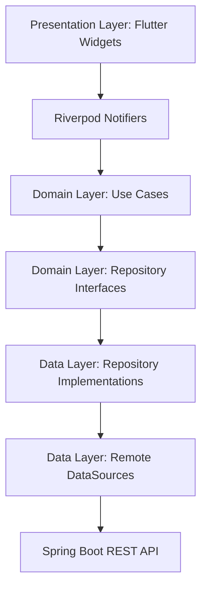

# Deshmukh Hardware & Steel ERP - Technical Documentation

## 1. High-Level Overview
The Deshmukh ERP is a professional, multi-platform enterprise application designed to manage inventory, sales, CRM, and financial operations for industrial-scale hardware businesses. It is built for high reliability, performance, and cross-platform compatibility (Web, Mobile, Desktop).

### Core Goals
- **Real-Time Visibility**: Direct integration with a Spring Boot cloud backend.
- **Industrial Performance**: Optimized rendering and state management.
- **Secure Access**: Role-based access control (RBAC) across all sensitive modules.

---

## 2. Architecture: The Clean Blueprint
The application follows a **Features-First Clean Architecture** pattern. This ensures that every module is isolated, testable, and maintainable.

### Layers Description
1.  **Presentation Layer** (`lib/features/*/presentation`): Contains Flutter widgets and Riverpod notifiers. It is responsible only for rendering the UI and handling user interactions.
2.  **Domain Layer** (`lib/features/*/domain`): The "Brain" of the feature. Contains pure business logic, entities, and repository interfaces. It has zero dependencies on Flutter or external libraries.
3.  **Data Layer** (`lib/features/*/data`): Responsible for data retrieval. Implements repository interfaces and communicates with the backend via `RemoteDataSource` using **Dio**.

---

## 3. State Management: Riverpod 2.x
We use **Riverpod** with code generation (`riverpod_generator`) for robust state management.

### Key Patterns
- **AsyncNotifier**: Used for most features to handle asynchronous data fetching from the API with built-in loading and error states.
- **Reactive Routing**: The [AppRouter](file:///A:/Workspace/d-h-s/lib/core/router/app_router.dart) listens to authentication and startup states to automatically protect routes.
- **Auto-Dispose**: Most providers are set to auto-dispose to keep memory usage minimal on mobile devices.

---

## 4. Networking & API Integration
The app communicates with the Spring Boot backend via a centralized [ApiClient](file:///A:/Workspace/d-h-s/lib/core/network/api_client.dart).

### Networking Stack
- **Dio**: High-performance HTTP client.
- **Interceptors**:
    - **Logging**: Automatically logs all requests/responses in debug mode.
    - **Auth**: Injects JWT tokens into the headers of every request.
- **Error Mapping**: Converts HTTP errors (404, 500, etc.) into domain-specific `Failure` objects defined in `lib/core/error`.

### Environment Configuration
Base URLs are managed in [AppConfig](file:///A:/Workspace/d-h-s/lib/core/config/app_config.dart).
- **Development**: `http://localhost:8080/api/v1`
- **Production**: `https://api.deshmukh-erp.com/v1`

---

## 5. Functional Modules Specification

### 📦 Inventory Module
- **Live Sync**: Fetches product master and stock levels in real-time.
- **Stock Adjustment**: Functional logic to adjust inventory counts with automatic activity logging.
- **Search**: Integrated into the Global Search engine for rapid SKU lookup.

### 🧾 Sales Module
- **Invoice Drafts**: In-memory draft system for complex invoice creation.
- **PDF Engine**: Local PDF generation and printing via [PdfService](file:///A:/Workspace/d-h-s/lib/core/services/pdf_service.dart).
- **Post-Create Sync**: Invoices are sent to the cloud and indexed locally for search.

### 👥 CRM & Employees
- **Ledger Tracking**: Tracks outstanding balances and transaction history per customer/supplier.
- **Attendance**: Real-time staff check-in/check-out system.

### 💰 Finance
- **Cash Book**: In-memory ledger for tracking business liquidity.
- **Cloud-Only**: Every entry is persisted immediately to the backend to ensure financial accuracy.

---

## 6. Security: Role-Based Access Control (RBAC)
Security is enforced at the UI level using the [PermissionWrapper](file:///A:/Workspace/d-h-s/lib/core/widgets/permission_wrapper.dart).

| Role | Access Level | Restricted Actions |
| :--- | :--- | :--- |
| **Admin** | Full System Access | None |
| **Manager** | Operational Management | Cannot view/edit salaries or business settings. |
| **Employee** | Daily Transactions | Cannot see profit figures, manage employees, or adjust financial entries. |

---

## 7. Design System: Industrial Blue
The UI follows a strict "Industrial" design language using the **DesignTokens** system.

### Key Tokens
- **Primary Color**: `#1E40AF` (Steel Blue)
- **Accent Color**: `#F59E0B` (Industrial Amber)
- **Spacing**: Use `context.tokens.space16`, `space24`, etc.
- **Rounding**: Standardized via `tokens.radiusLg` (16px).

> [!TIP]
> Never hardcode `SizedBox` heights or `Color` values. Always use the context-based theme extensions to ensure consistent branding across all screens.

---
© 2026 Deshmukh Hardware & Steel. All rights reserved.
