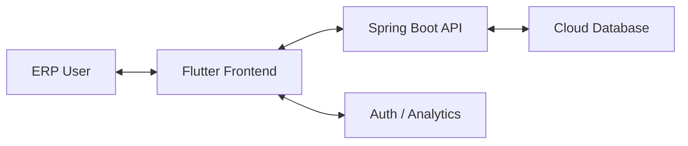

# 05 Architecture: DCI ERP Technical Blueprint

## 5.1 Architecture Overview
DCI ERP is built on a **Features-First Clean Architecture** with a **Cloud-Only** data flow. This pattern separates the UI from the business logic and the external API, ensuring a modular and testable codebase.

## 5.2 Clean Architecture Layers

### 1. Presentation Layer (`lib/features/*/presentation`)
*   **Widgets**: Pure UI components using Material 3.
*   **Riverpod Notifiers**: Manage feature state (e.g., `InventoryNotifier`). They bridge the gap between the user and the logic.

### 2. Domain Layer (`lib/features/*/domain`)
*   **Entities**: Pure Dart objects (e.g., `Product`, `Invoice`).
*   **Use Cases**: Specific business logic units (e.g., `AdjustStock`).
*   **Repository Interfaces**: Contract definitions for data operations.

### 3. Data Layer (`lib/features/*/data`)
*   **Models**: DTOs for JSON serialization (e.g., `ProductModel`).
*   **Repository Implementations**: Logic for choosing between different data sources.
*   **Remote DataSources**: API communication logic using **Dio**.

## 5.3 System Context Diagram


## 5.4 State Management: Riverpod
The application uses **Generated Riverpod Providers** for type safety and reduced boilerplate.

*   **Logic Flow**:
    1.  UI watches an `AsyncNotifier`.
    2.  Notifier calls a `UseCase` in the Domain layer.
    3.  UseCase calls a `Repository` in the Data layer.
    4.  Repository fetches from `Dio` (Backend).
    5.  Result flows back up as a `Result<T>` or `AsyncValue`.

## 5.5 Dependency Injection
We use a centralized [InjectionContainer](file:///A:/Workspace/d-h-s/lib/core/di/injection_container.dart) (`sl`) to manage singleton instances of Use Cases and DataSources.

## 5.6 Navigation Strategy
**GoRouter** manages the application routing. It is reactive, meaning it listens to the `authProvider` and `startupProvider` to enforce redirects:
-   **Not Initialized** -> Splash (Legacy) / Loading.
-   **Unauthenticated** -> Login.
-   **Authenticated** -> Dashboard.

## 5.7 Folder Structure
```text
lib/
├── components/         # Reusable UI Atoms (KpiCard, ItemRow)
├── core/               # Shared Infrastructure
│   ├── config/         # AppConfig, Base URLs
│   ├── network/        # Dio ApiClient, Interceptors
│   ├── router/         # GoRouter, Route Notifiers
│   └── design_system/  # AppTheme, DesignTokens
└── features/           # Modular Business Features
    ├── inventory/
    ├── sales/
    └── crm/
```
