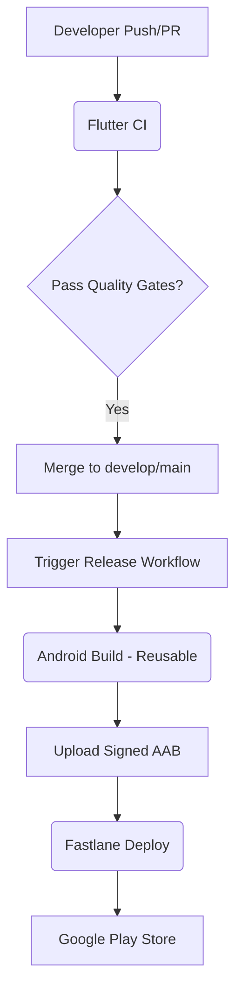

# CI/CD Architecture

This document describes the architecture of the CI/CD pipeline for the Flutter Android application.

## Overview

The pipeline is built using GitHub Actions and consists of three main workflows:

1.  **Flutter CI (`flutter-ci.yml`)**: Triggered on every Pull Request and Push to `develop` and `main` branches. It ensures code quality and runs tests.
2.  **Android Build (`android-build.yml`)**: A reusable workflow that builds signed Android App Bundles (AAB) or APKs.
3.  **Android Release (`android-release.yml`)**: Orchestrates the deployment of the application to different Google Play tracks.

## Pipeline Flow

## Quality Gates

- **Formatting**: `dart format` ensures consistent code style.
- **Static Analysis**: `flutter analyze` checks for potential issues and linting violations.
- **Unit & Widget Tests**: `flutter test` executes the test suite.
- **Debug Build**: Verifies that the application compiles correctly.

## Release Progression

The pipeline supports progression through multiple environments/tracks:

- **Internal**: Automated or manual trigger for internal testing.
- **Alpha/Beta**: Manual trigger for closed testing groups.
- **Production**: Manual trigger or automated on version tags (`v*`), requiring manual approval via GitHub Environments. The track is automatically set to `production` when a tag is pushed.
